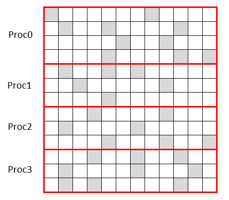

# High_Performance_Technical_Computing

## Contents

1.  [Abstract](#abstract)
2.  [Introduction](#introduction)
2.  [Methods](#methods)
3.  [Results](#results)
4.  [Discussion](#discussion)
5.  [Future Work](#future-work)
6.  [Conclusion](#conclusion)

## Abstract

To study a sparse-matrix fat-vector multiplication, five different methods
which use C++ are presented. Two of them are serial methods
and the other three, which use both the Message Passing Interface
library and C++, are parallel methods. While, the first serial implementation
does not take advantage of the sparse matrix, the second
one uses the Compressed Sparse Rows data format. It is observed that
the advantages of the compressed format are shown when the size of
the matrices reaches a certain threshold, then, the computation time
of the compressed format becomes relatively smaller. The three parallel
methods are analysed using the speedup, and the performance
is assessed using strong and weak scalability. For this, various sizes
of matrices are used and also an increasing number of processors. It
is observed that the second parallel method is the most efficient to
compute big matrices while the serial using the Compressed Sparse
Rows storage format is best for small matrices.

## Introduction

At the beginning of the computational era, the performance of the central
processing units (CPU) was rapidly increasing; however, in recent year, the
rate at which the performance improves has been decreasing. At the same
time, there has been a greater need to solve more and more complex problems.
In order to be able to solve those problems, a parallel version of the serial
programs, using multiple CPUs in parallel to solve a single problem, has
become a solution.

### High Performance Computing

High Performance Computing (HPC) is a technology that uses the computational
power of supercomputers or clusters of computers. Supercomputers
are made of multiple processors running in parallel and each processor has
its own local memory, but they are able to communicate with each other.

<p align="center"><p align="center">
<div align="center">
<b>Figure 4.3: Solution of the Crank-Nicholson method compared to the analytical solution at t=0.5</b>
</div> 

Message Passing Interface (MPI) [1] is the programming environment used
for such distributed-memory systems. It was created in the 1990s and it
allows the processes to communicate with each other by sending and receiving
messages.

### Sparse-matrix fat-vector multiplication

Simply put, a sparse matrix is a matrix in which most elements are equal to
zero. James Wilkinson defined a sparse matrix as the following: [2]:
Any matrix with enough zeros that it pays to take advantage of them.

In this case, the sparse-matrix, M, will have m rows and n columns.The
fat-vector, v, will have n rows and k columns; thus, the fat-vector can be
assimilated to a dense matrix. The result matrix will be of the size m x k.

<p align="center"><p align="center">
<div align="center">
<b>Figure 4.3: Solution of the Crank-Nicholson method compared to the analytical solution at t=0.5</b>
</div> 

The mathematical formula to compute a matrix multiplication is the following
one:

<p align="center"><p align="center">
<div align="center">
<b>Figure 4.3: Solution of the Crank-Nicholson method compared to the analytical solution at t=0.5</b>
</div> 

For i varying from 1 to m and j varying from 1 k.

In the next sections, I will introduce the tools that were used to implement
the different methods. Next, the implementation of the different methods will
be explained, followed by the results of each method. The parallel results
will then be compared to the most efficient serial method and the results will
be discussed. Some potential future work will also be presented and, finally,
we will conclude this study.

## Methods

### Employed tools

In this report, the C++ [3] language will be used to compare a serial program
to three different parallel versions. To create the parallel programs the MPI
library will be used. The HPC facility used to run the jobs is the CRanfield
Educational Scientific Computing ENvironment for Teaching (Crescent). It
has 1488 available cores, and a theoretical peak performance of 28.2 TFlops.

### Sparse-matrix generation and used formats

In the serial and parallel implementations the sparse-matrix and fat-vector 
were generated with the same algorithm. In the parallel versions the root
process, process 0, was carrying out this task. The following C++ code
illustrates how the generation was done:

```cpp
// Algorithm 1: Sparse-matrix and fat-vector generation

// Step 1: Initialize sparse matrix M[m][n] and fat vector v[n][k] with zeros
int M[m][n] = {0};
int v[n][k] = {0};
int randomInt = 0;

// Step 2: Populate the sparse matrix M
for (int i = 0; i < m; i++) {
    for (int j = 0; j < n; j++) {
        randomInt = rand() % 27;
        
        // Step 3: To get 1/3 of non-zero values
        if (randomInt < 10) {
            M[i][j] = randomInt;
        }
    }
}

// Step 4: Populate the fat vector v
for (int i = 0; i < n; i++) {
    for (int j = 0; j < k; j++) {
        randomInt = rand() % 10;
        v[i][j] = randomInt;
    }
}
```


As one can observe in the Algorithm 1, approximately 1/3 of the sparsematrix
is composed of non zero integers between 1 and 9. On the other hand, the fat-vector is composed of values between 0 and 9.
It would be a waste to be working with sparse matrices without taking advantages
of their properties. Thereby, there are multiple ways of storing sparse
matrices to avoid the storage of the zero values. The COOrdinate format
(COO) and the Compressed Sparse Rows (CSR) formats [7] will be used in
some of the following methods.

<p align="center"><p align="center">
<div align="center">
<b>Figure 4.3: Solution of the Crank-Nicholson method compared to the analytical solution at t=0.5</b>
</div> 

In the COO format the non-zero values are stored in an array. The index
of the row and of the column of each non-zero element are stored in two
different arrays.

<p align="center"><p align="center">
<div align="center">
<b>Figure 4.3: Solution of the Crank-Nicholson method compared to the analytical solution at t=0.5</b>
</div> 

In the CSR format the non-zero values and its column index are stored in
two arrays. The third array is composed of pointers to the index of the non
zero value, see Figure 4.

### Serial methods

The first serial implementation does not take advantage of the sparse matrix.
This method contains three nested loops, thus, it has a time complexity of
O(m * n * k). The following C++ code uses the equation 1 to implement
the matrix product.

```cpp
// Algorithm 2: Serial implementation of equation 1

// Step 1: Initialize result matrix result[m][k] with zeros
int result[m][k] = {0};

// Step 2: Calculate the result matrix
for (int i = 0; i < m; i++) {
    for (int j = 0; j < k; j++) {
        int temp = 0;
        
        // Step 3: Perform matrix multiplication
        for (int x = 0; x < n; x++) {
            result[i][j] += M[i][x] * v[x][j];
        }
    }
}
```


A second serial method was implemented to compare the performance with
a method which takes advantage of the sparse-matrix. The CSR storage
format was chosen for this comparison. The following algorithm presents the
serial CSR method.

```cpp
// Algorithm 3: Serial implementation of the CSR storage format

// Step 1: Initialize result matrix result[m][k] with zeros
// Assume that the three arrays nonZeros, columnIndex, and indexPointer are populated
int result[m][k] = {0};

// Step 2: Calculate the result matrix using CSR storage format
for (int x = 0; x < k; x++) {
    for (int i = 0; i < m; i++) {
        int temp = 0;
        
        // Step 3: Perform matrix multiplication with CSR storage format
        for (int j = indexPointer[i]; j < indexPointer[i + 1]; j++) {
            temp += nonZeros[j] * v[columnIndex[j]][x];
        }
        
        result[i][k] = temp;
    }
}
```

The time complexity of this algorithm is O(k * m * nZ), with nZ being the
number of non-zero values. In our case, we initialize the sparse matrix with
1/3 of non-zero values. The best possible outcome would be a run time
divided by three. In practice, this is not possible because three arrays need
to be initialized before computing the CSR. The run time comparison of the
two serial methods can be found in Appendix 7.1. It stands out that the run
time of the CSR method is shorter. In the following sections when referring
to the serial method it will correspond to the serial CSR implementation.

### Performance analysis

Parallel programs can be analysed by comparing their execution time on
one processor to the execution time in multiple processors. The speedup is
defined as follows:

<p align="center"><p align="center">
<div align="center">
<b>Figure 4.3: Solution of the Crank-Nicholson method compared to the analytical solution at t=0.5</b>
</div> 

The time will be measured using the MPI Wtime() function.

The scalability of the parallel program can also be analyzed. Two different
scalabilities will be used in this report. First, the strong scalabilty in
which the number of processors is growing for a fixed problem size. Second,
the weak scalabality, in which the number of processors is growing with a
fixed problem size per processor.

### Parallel methods

The key points in distributed-memory parallel programming are to minimize
the communication between the processors while equally dividing the work
between them (load balancing). To accomplish this, the primary goal is to
understand what to exchange, when to do it and with which communication
method. The three parallel methods presented in the following sections attempt
to implement those core concepts.

In the three different methods, some common MPI functions have been
used to communicate between the processes. For example, the fat-vector
is broadcast-ed to each process in each method. Next, when some data needs
to be sent to the processes, it is essential to have a good load-balancing.
Hence, the following algorithm is used several times.

```cpp
// Algorithm 4: Load balancing rows

// Step 1: Initialize sendCount array for npes (number of processes)
int sendCount[npes] = {0};

// Step 2: Calculate the remaining rows after equal distribution
int remaining = m / npes; // m is the number of rows

// Step 3: Distribute rows among processes
for (int i = 0; i < npes; i++) {
    sendCount[i] = m / npes;
    
    // Step 4: Distribute remaining rows
    if (remaining > 0) {
        sendCount[i] += 1;
        remaining -= 1;
    }
}
```

<p align="center"><p align="center">
<div align="center">
<b>Figure 4.3: Solution of the Crank-Nicholson method compared to the analytical solution at t=0.5</b>
</div> 

Moreover, MPI Scatterv and MPI Gatherv are often used in the different
methods. MPI Scatterv is an extension of MPI Scatter, it enables to scatter
data of different sizes between all the processes. MPI Gatherv is the inverse
operation of MPI Scatterv. An example of MPI Scatterv can be observed in
Figure 5.

Finally, in each method the root process is the one that has the largest
workload because it does the same amount of computation as the other processes
with some additional operations. For example, it needs to calculate
how to do the load balancing for each method. Hence, when analyzing the
complexity the root process will be overlooked.

#### First Method

The first parallel method does not take advantage of the sparse matrix. First,
it calculates how to split the matrix by row between all the processes with
algorithm 4. It creates two arrays sendCount and positions with a size equal
to the number of processes. sendCount describes the amount of data the
root process needs to send to the other processes, while positions describes
how the sparse-matrix will be truncated, see figure 6.

<p align="center"><p align="center">
<div align="center">
<b>Figure 4.3: Solution of the Crank-Nicholson method compared to the analytical solution at t=0.5</b>
</div> 

Next, the rows of the sparse matrix are sent using MPI Scatterv, a collective
communication. Once each process has computed the results the information
is gathered in the root process using MPI Gatherv. The C++ code can be
found in Appendix 7.4 and the pseudo code in Algorithm 5.

The time complexity per processor is the following:

<p align="center"><p align="center">
<div align="center">
<b>Figure 4.3: Solution of the Crank-Nicholson method compared to the analytical solution at t=0.5</b>
</div> 

With (m / npes + 1) being the maximum amount of data that a processor
will receive.
This method is not expected to be very efficient because it does not take
advantage of the sparse-matrix. It results in a large number of zero values
sent and computed, resulting in a loss of performance.

#### Second Method

The second parallel method uses the CSR storage format. The CSR is initialized
by the root process. First, it calculates how to split the sparse-matrix by
row with algorithm 4. Then, it calculates how to split the arrays nonZeros
and columnIndex according to the row distribution. Also, it broadcasts the
indexPointer array. To send the arrays nonZeros and columnIndex it uses
one MPI Scatterv for each array. At this stage, each process computes the
result with the CSR method. Finally, the MPI Gatherv is used to regroup
the computed results back into the root. The sparse-matrix is truncated in
the same way as in figure 6, the difference is that only the non-zero values
are computed.

```cpp
// Algorithm 5: First method
// Require: npes (number of processes), sendCount[npes], positions[npes], receiveBuffer[(m/npes + 1) * n], sendBuffer[(m/npes + 1) * n]

// Step 1: Broadcast vector v
MPI_Bcast(v);

// Step 2: Scatter matrix M
MPI_Scatterv(M);

// Step 3: Initialize index and lineNb variables
int index = 0;
int lineNb = sendCount[rank] / n;

// Step 4: Calculate sendBuffer values
for (int i = 0; i < lineNb; i++) {
    for (int j = 0; j < k; j++) {
        for (int x = 0; x < n; x++) {
            sendBuffer[index] += receiveBuffer[i * n + x] * v[x][j];
        }
        index += 1;
    }
}

// Step 5: Calculate positions and sendCount for gathering data at root
for (int i = 0; i < npes; i++) {
    positions[i] = positions[i] / n * k;
    sendCount[i] = sendCount[i] / n * k;
}

// Step 6: Gather sendBuffer values at root
MPI_Gatherv(sendBuffer);
```


The time complexity per processor is the following:

<p align="center"><p align="center">
<div align="center">
<b>Figure 4.3: Solution of the Crank-Nicholson method compared to the analytical solution at t=0.5</b>
</div> 

With nZavg being the average number of non-zero values per row.
This method is expected to be the one with the best performances. Because
it uses collective communications to scatter and gather the data efficiently
between the processes. It also adopts the CSR storage which reduces the
number of operations.

#### Third Method

The last method uses the COO storage format, it is initialized by the root process.
It splits the sparse-matrix by row using the same method as the second
method. Then it calculates how to split the arrays nonZeros, columnIndex
and rowIndex. Then the root process uses MPI Send 3 times for each process
to send the data according to the calculated split. The other processes
receive the data with three consecutive MPI Recv. Then, they compute the
result matrix and the data is sent back to the root with MPI Gatherv.
The time complexity per processor is the following:

<p align="center"><p align="center">
<div align="center">
<b>Figure 4.3: Solution of the Crank-Nicholson method compared to the analytical solution at t=0.5</b>
</div> 

This method is expected to be the one with the second best performance,
because the data is sent with three MPI Send and MPI Recv for each process.
It is a blocking communication, hence the communication time is expected to
be higher than the second method. Furthermore, the computation is expected
to be approximately the same as the second method but faster than the first
one because of the COO storage.

## Results

In this section, we will present the results of the most efficient serial implementation
with the three parallel methods. Three different matrix sizes
will be used, the first in the tens, next in the hundreds and, finally, in the
thousands.

### Accuracy of the results

<p align="center"><p align="center">
<div align="center">
<b>Figure 4.3: Solution of the Crank-Nicholson method compared to the analytical solution at t=0.5</b>
</div> 

Figure 7 shows the results of the serial and three parallel methods extracted
on a csv file.

### Communication and computation cost

Three different sizes were chosen to compute the following results.

• Small : m = 45, n = 50 k = 55.

• Medium : m = 450, n = 500, k = 550.

• Large : m = 1050, n = 1100, k = 1200.

<p align="center"><p align="center">
<div align="center">
<b>Figure 4.3: Solution of the Crank-Nicholson method compared to the analytical solution at t=0.5</b>
</div> 

<p align="center"><p align="center">
<div align="center">
<b>Figure 4.3: Solution of the Crank-Nicholson method compared to the analytical solution at t=0.5</b>
</div> 

<p align="center"><p align="center">
<div align="center">
<b>Figure 4.3: Solution of the Crank-Nicholson method compared to the analytical solution at t=0.5</b>
</div> 

<p align="center"><p align="center">
<div align="center">
<b>Figure 4.3: Solution of the Crank-Nicholson method compared to the analytical solution at t=0.5</b>
</div> 

<p align="center"><p align="center">
<div align="center">
<b>Figure 4.3: Solution of the Crank-Nicholson method compared to the analytical solution at t=0.5</b>
</div> 

<p align="center"><p align="center">
<div align="center">
<b>Figure 4.3: Solution of the Crank-Nicholson method compared to the analytical solution at t=0.5</b>
</div> 

Figure 8, 9 and 10 show the communication cost of the three parallel methods
with a varying number of processes and different matrix sizes. It can be
observed that for the small and medium sizes that the communication cost
is approximately the same. Whereas, for the large size the communication
cost is bigger for the first method when the number of processes is between
2 and 8.

Figure 11, 12 and 13 show the computation cost of the three parallel implementations
with a varying number of processes and different matrix sizes.
It stands out that the first method is the most expensive in term of computation.
The other two are close to each other.

### Performance

<p align="center"><p align="center">
<div align="center">
<b>Figure 4.3: Solution of the Crank-Nicholson method compared to the analytical solution at t=0.5</b>
</div> 

<p align="center"><p align="center">
<div align="center">
<b>Figure 4.3: Solution of the Crank-Nicholson method compared to the analytical solution at t=0.5</b>
</div> 

<p align="center"><p align="center">
<div align="center">
<b>Figure 4.3: Solution of the Crank-Nicholson method compared to the analytical solution at t=0.5</b>
</div> 

Figure 14, 15 and 16 show the run time of the three parallel implementations
with a varying number of processes and different matrix sizes.

<p align="center"><p align="center">
<div align="center">
<b>Figure 4.3: Solution of the Crank-Nicholson method compared to the analytical solution at t=0.5</b>
</div> 

Figure 17 compares the run time of the serial implementation to the run
time of the parallel methods with 2 processes. It stands out that the parallel
methods are faster for the medium and large sizes.

<p align="center"><p align="center">
<div align="center">
<b>Figure 4.3: Solution of the Crank-Nicholson method compared to the analytical solution at t=0.5</b>
</div> 

Figure 18 shows the strong scalability of the three parallel methods with the
large size.

<p align="center"><p align="center">
<div align="center">
<b>Figure 4.3: Solution of the Crank-Nicholson method compared to the analytical solution at t=0.5</b>
</div> 

Figure 19 shows the weak scalability of the three parallel methods with 33
million operations per process. It was not possible to compute the third
method with 8 and 16 processes because of memory management.

## Discussion

To be able to assert the accuracy of the obtained results, a common seed
is given to the random number generator. It enables to generate the same
sparse-matrix and fat-vector for every implementation. One can observe in
figure 7 that the result matrix is the same with each method. Thus, it shows
that they are accurate.

It was observed in figure 17 that the run time of the parallel methods is
longer than the run time of the serial implementation for the small size. This
is because for small problems the communication time is not compensated
by the gain in computation. This compensation is starting to be observable
with the medium size. As a consequence, we will focus on the results produced
by the large size.

Figure 10 shows that the first method is more communication expensive
for a small number of processes. Next, as expected, the first method is also
the most computational expensive. This can be observed in figure 13.

Moreover, it is observed in figure 16 that the second method is the most
efficient, next comes the third method and last the first method. This result
meets the expectations made in the beginning.

In terms of performance, the first method is surprisingly the one with the
best scalability as it was observed in figure 18. Regarding the weak scalability
of the parallel methods, it is observed in figure 19 that the efficiency per
process is decreasing with the number of processes.

## Future Work

To begin, the work presented in this report can be further improved with the
use of other communication patterns in order to reduce the communication
time. One attempt could be the use of non-blocking communication patterns
such as MPI Isend and MPI Irecv. Such communication patterns need to be
used carefully because the data that is sent must not be modified before the
process receives it. In our examples collective communication patterns were
used, to obtain the best possible performance they are not recommended.

Next, it would be interesting to optimise the memory management of those
methods. Because, when the memory is managed well the time it takes to
access it is reduced. Improving the memory management to reduce accesses
to the main memory would be a big step to obtain better performances.

## Conclusion

To solve a sparse-matrix fat-vector multiplication five different methods were
presented in this report. Two of them were serial implementations and the
other three were distributed-memory parallel implementations using MPI
and C++. The speedup and the performance of those methods were studied
using strong and weak scalability plots. The obtained results were close to
the expected ones.

Regarding the serial methods, it was observed that the advantage of the
CSR storage format becomes clear once the size of the matrices reaches a
certain threshold.

Regarding the parallel methods, as expected it was shown that the second
parallel method is the most efficient to compute a sparse-matrix fat-vector
multiplication. Additionally, the first method was observed to be the one
with the best scalabality.

During this study, it became clear that to obtain the best possible performance
an almost perfect synchronisation needs to be achieved. Meaning that
the solution need to exchange as little data as possible with an almost perfect
load balance between the processes. This can be achieved by understanding
when to communicate, with which communication pattern and what data.

## References

[1] MPI: A Message-Passing Interface Standard, n.d. 1139.

[2] Davis, T.A., Hu, Y., 2011. The university of Florida sparse
matrix collection. ACM Trans. Math. Softw. 38, 1–25.
https://doi.org/10.1145/2049662.2049663

[3] Stroustrup, B., 2013. The C++ programming language, Fourth edition.
ed. Addison-Wesley, Upper Saddle River, NJ.

[4] Mattson, T.G., Sanders, B.A., Massingill, B., 2005. Patterns for parallel
programming. Addison-Wesley, Boston.

[5] Gropp, W., Lusk, E., Skjellum, A., 1999. Using MPI: portable parallel
programming with the message-passing interface, 2nd ed. ed, Scientific
and engineering computation. MIT Press, Cambridge, Mass.

[6] Pacheco, P.S., 2011. An introduction to parallel programming. Morgan
Kaufmann, Amsterdam: Boston.

[7] Filippone, S., Cardellini, V., Barbieri, D., Fanfarillo, A., 2017. Sparse
Matrix-Vector Multiplication on GPGPUs. ACM Trans. Math. Softw.
43, 1–49. https://doi.org/10.1145/3017994

[8] Buluc, A., Gilbert, J., 2012. Parallel Sparse Matrix-Matrix Multiplication
and Indexing: Implementation and Experiments. SIAM J. Sci.
Comput. 34, C170–C191. https://doi.org/10.1137/110848244